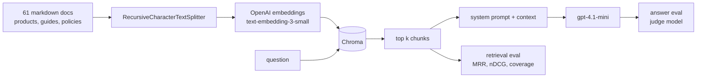

# StyleSense

A RAG assistant over a fashion catalogue, built to answer one question honestly:
**how much does each retrieval decision actually buy you?**

Most RAG tutorials end when the chatbot replies. This one starts there. Every
configuration below was measured against the same 16 question test set, and the
numbers decided what shipped.

Built while working through the retrieval week of Ed Donner's LLM engineering
course. The pipeline is deliberately day 1 to day 4 material only: LangChain,
Chroma, character splitting, similarity search. No reranking, no query rewriting.
The contribution is the measurement.

---

## The finding

The default settings everyone copies from the tutorial were not the best settings
for this corpus, and the winning change was made at ingestion time, not at query time.

| | chunk 1000 / overlap 200 (tutorial default) | chunk 2000 / overlap 400 (measured winner) |
|---|---|---|
| retrieval coverage | 64.0% | **69.6%** |
| MRR | 0.351 | 0.394 |
| answer accuracy | 4.38 / 5 | **4.94 / 5** |
| answer completeness | 2.56 / 5 | **2.94 / 5** |
| answer relevance | 4.94 / 5 | 4.75 / 5 |

Same k, same embedding model, same prompt. The only change was how the documents
were split before they were ever embedded.

---

## Two evaluations, because they answer different questions

**Retrieval evaluation** (`evaluation/eval_retrieval.py`) scores whether the right
chunks came back. Each test question carries keywords that must appear in the
retrieved chunks, and the ground truth is parsed from the corpus itself, not
hand written, so a typo cannot silently score zero forever.

- **MRR** rewards getting one right chunk to the top
- **nDCG** rewards rank position
- **coverage** is the share of expected keywords found anywhere in the top k

No LLM is involved, so it is instant, free and identical on every run. That is
what makes an 18 configuration sweep affordable.

**Answer evaluation** (`evaluation/eval_answers.py`) scores whether the final
answer was any good, using a judge model against a reference answer, on accuracy,
completeness and relevance. Slow, costs money, drifts slightly between runs.

The relationship between them turned out to be the most useful result in the project.

---

## Result 1: retrieval coverage predicts answer completeness

Per category, comparing the tutorial default against the measured winner:

| category | coverage | completeness |
|---|---|---|
| direct_fact | 90% to 100% | 3.20 to 3.60 |
| occasion | 32% to 42% | 1.25 to **2.50** |
| constraint | 58% to 58% | 2.50 to **2.50** |
| enumeration | 71% to 71% | 3.33 to 3.00 |

Where coverage moved, completeness moved. Where coverage did not move, completeness
did not move, to two decimal places on `constraint`. So the free deterministic metric
can be used to iterate, and the expensive judge only to confirm the winner.

## Result 2: raising k is mostly a mirage

Coverage rises with k for a trivial reason: a question expecting 13 keywords cannot
score above 8/13 when k is 8. So the eval reports the arithmetic ceiling next to
every score.

| config | coverage | ceiling | share of what was possible |
|---|---|---|---|
| 2000/400, k=8, similarity | 69.6% | 90.8% | **76.7%** |
| 2000/400, k=16, mmr | 75.6% | 100% | 75.6% |
| 2000/400, k=16, similarity | 74.9% | 100% | 74.9% |
| 1000/200, k=8, similarity | 64.0% | 90.8% | 70.5% |

Doubling k doubled the context sent to the model, showed +5.3 points of raw
coverage, and was a small regression in share of achievable. A coverage number
without its ceiling is not a measurement.

## Result 3: MMR does exactly what it says, and it is not free

Maximal marginal relevance targets redundancy, where several near identical chunks
from one long document fill every slot. At 2000/400 with k=16 it moved the
`occasion` category from 54% to 59%, the category it was aimed at, and dropped
`direct_fact` from 100% to 90%. At k=4 and k=8 it collapsed, because with few slots
the relevance traded away costs more than the redundancy removed.

## Result 4: the biggest accuracy failure was a data problem

`about-stylesense.md` advertises a 30 day return window with free return shipping.
`returns-and-exchanges-policy.md` states 15 calendar days with return shipping paid
by the customer. Two questions about returns scored accuracy 2 and 1 on the default
config, dragging `direct_fact` accuracy to 3.60, the worst of any category, in the
category RAG is supposed to be best at.

Larger chunks fixed it to 4.80, not by ranking better but by keeping the whole
policy together instead of a fragment competing with the contradiction. No amount
of retrieval tuning fixes a knowledge base that disagrees with itself.

## Result 5: numeric constraints never improved, under any configuration

The catalogue has 13 products at or under Rs 1500. Asked for "something under 1500
rupees", the system retrieved 2, and that did not change across all 18
configurations. `constraint` coverage was 58% before and 58% after.

Cosine similarity has no concept of *less than*. Nothing in days 1 to 4 can fix
this, which is the honest ending of this project and the start of the next one.

Full sweep: [`eval_results.md`](eval_results.md)

---

## How it works



`app.py` and both evaluations import from `rag.py`. That is deliberate: if the
evaluation builds its own retriever, you are measuring a system you do not ship.

---

## Run it

```bash
cp .env.example .env          # add your OpenAI key
pip install -r requirements.txt

python build_knowledge_base.py   # generates the 61 document corpus
python ingest.py 2000 400        # chunk, embed, store
python build_tests.py            # test set, ground truth parsed from the corpus
python app.py                    # the assistant
python evaluator.py              # the evaluation dashboard
```

To reproduce the sweep:

```bash
python ingest.py 500 100
python ingest.py 1000 200
python ingest.py 2000 400
python experiment.py             # 18 configurations, writes eval_results.md
```

Total API cost for a full rebuild plus the sweep plus one judged run is a few cents
on `gpt-4.1-mini` and `text-embedding-3-small`.

---

## Files

| file | what it does |
|---|---|
| `build_knowledge_base.py` | generates the corpus: 52 products, 5 guides, 4 policies |
| `ingest.py` | loads, chunks, embeds, stores. Chunk size and overlap are arguments |
| `rag.py` | retrieval and generation. The only copy, shared by the app and the evals |
| `app.py` | Gradio assistant |
| `visualize.py` | t-SNE of the vector store, coloured by document type |
| `build_tests.py` | writes the test set, with every keyword verified against the corpus |
| `evaluation/eval_retrieval.py` | MRR, nDCG, coverage, with the ceiling |
| `evaluation/eval_answers.py` | judge model on accuracy, completeness, relevance |
| `experiment.py` | the 18 configuration sweep |
| `evaluator.py` | dashboard for both evaluations, with live configuration switching |
| `tests/` | pytest suite over the metrics, the ceiling and the ground truth. No API calls |

---

## Tests

The numbers above are only worth as much as the code that produced them, so the
scoring functions are tested against hand-computed values.

```bash
pip install -r requirements-dev.txt
pytest
```

30 tests, no API calls, under a second. They cover four things:

- **the metrics** — MRR and nDCG against values worked out by hand, including the
  cases that quietly go wrong: a keyword appearing twice must score its *first*
  rank, a hit beyond `k` must not count, and zero relevant chunks must return 0.0
  rather than dividing by zero.
- **the ceiling** — 13 keywords at k=8 caps at 8/13, but 3 keywords at k=8 is 100%
  and not 8/3. Result 2 rests on that `min()`, and one test pins the 90.8% and 100%
  ceilings quoted above so changing the test set forces the README to be updated.
- **the ground truth** — every keyword in `tests.jsonl` must actually appear
  somewhere in `knowledge-base/`. A keyword that appears nowhere is unreachable and
  would drag coverage down on every run, forever, without ever announcing itself.
- **the lazy client** — importing `rag` must not construct `ChatOpenAI`. The
  retrieval evaluation imports this module for `fetch_context` and never generates
  an answer, so the free, deterministic half of the evaluation must not require
  credentials it never uses.

## Limitations

- 16 test questions written by one person, so the ground truth encodes my judgement.
  Whether a unisex kurta counts as "a kurta for men" is a decision I made, and the
  scores move if you disagree.
- Retrieval relevance is keyword substring matching, a lexical proxy. A chunk can be
  genuinely relevant and score zero for not containing the exact word.
- The judge ran once per configuration. No variance measurement, so small differences
  in the answer scores should not be trusted.
- The evaluation calls `answer_question` without conversation history, while the app
  passes history. The harness measures a slightly different system from the demo.
- The corpus is LLM generated, so its language is cleaner than real product copy.

## What comes next

Metadata filtering, so a budget becomes a database `where` clause instead of a vector,
measured against this same test set. `constraint` coverage sat at 58% through all 18
configurations, so there is a clear number to beat.
