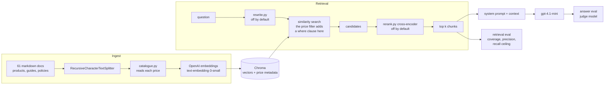

# StyleSense

> A RAG assistant over a fashion catalogue, built to answer one question honestly:
> **how much does each retrieval decision actually buy you?**


Most RAG tutorials end when the chatbot replies. This one starts there. Every
configuration below was measured against the same 16 question test set, and the
numbers decided what shipped.

Built while working through the retrieval week of Ed Donner's LLM engineering
course. Results 1 to 5 are day 1 to day 4 material only: LangChain, Chroma,
character splitting, similarity search. Results 6 and 7 go past that, to metadata
filtering, reranking and query rewriting, because Result 5 could not be fixed
without them. The contribution is the measurement.

---

## At a glance

The system could not answer "show me something under 1500 rupees". Cosine
similarity has no concept of *less than*, so on price questions the retriever
scored no better than a blindfolded draw. Moving the price out of the embedding
and into a metadata filter fixed it:

| | before | after |
|---|---|---|
| `constraint` coverage | 58.0% | **90.4%** |
| results breaking the stated budget | 14 | **0** |
| added latency per question | 0 | **0** |
| added tokens per question | 0 | **0** |

The three techniques usually reached for first were measured against that same
58.0% baseline. Query rewriting moved it 0.0 points on two prompts, dual
retrieval made it worse, and an LLM reranker reached 82.0% while charging 5,354
tokens and 2.08s per question.

[Result 6](#result-6-the-numeric-constraint-solved) is the fix.
[Result 7](#result-7-three-popular-fixes-measured) is what the alternatives scored.

---

## Contents

- [How it works](#how-it-works)
- [Quick start](#quick-start)
- [The finding](#the-finding), where chunk size beat every query-time knob
- [Two evaluations](#two-evaluations-because-they-answer-different-questions), and why there are two

**The seven results**

| | finding | headline number |
|---|---|---|
| 1 | [retrieval coverage predicts answer completeness](#result-1-retrieval-coverage-predicts-answer-completeness) | coverage moves, completeness moves |
| 2 | [raising k is mostly a mirage](#result-2-raising-k-is-mostly-a-mirage-and-the-exception-is-a-filter) | +5.3 points of coverage, a regression in share of achievable |
| 3 | [MMR does what it says, and it is not free](#result-3-mmr-does-exactly-what-it-says-and-it-is-not-free) | `occasion` 54% to 59%, `direct_fact` 100% to 90% |
| 4 | [the biggest accuracy failure was a data problem](#result-4-the-biggest-accuracy-failure-was-a-data-problem) | accuracy 3.60 to 4.80, by fixing the corpus |
| 5 | [numeric constraints never improved](#result-5-numeric-constraints-never-improved-under-any-configuration) | 58% across all 18 configurations |
| 6 | [the numeric constraint, solved](#result-6-the-numeric-constraint-solved) | **58.0% to 90.4%**, 14 violations to 0 |
| 7 | [three popular fixes, measured](#result-7-three-popular-fixes-measured) | rewriting 0.0, dual worse, reranker 82.0% |

- [Files](#files)
- [Tests](#tests)
- [Limitations](#limitations)
- [What comes next](#what-comes-next)

---

## How it works



The rewriter, the reranker and the price filter are all off by default, so the
solid path through the middle is what ships and what produced the baseline
numbers. The price filter is a pre-filter: it restricts the candidate set before
the nearest neighbour search rather than deleting violators afterwards, which is
why it is drawn on the search itself.

`app.py` and both evaluations import from `rag.py`. That is deliberate: if the
evaluation builds its own retriever, you are measuring a system you do not ship.

---

## Quick start

```bash
cp .env.example .env          # add your OpenAI key
pip install -r requirements.txt

python build_knowledge_base.py   # generates the 61 document corpus
python ingest.py 2000 400        # chunk, embed, store
python build_tests.py            # test set, ground truth parsed from the corpus
python app.py                    # the assistant
python evaluator.py              # the evaluation dashboard
```

To reproduce the sweep:

```bash
python ingest.py 500 100
python ingest.py 1000 200
python ingest.py 2000 400
python experiment.py             # 18 configurations, writes eval_results.md
```

To reproduce Results 6 and 7. The price filter needs an index carrying price
metadata, so rebuild with the current `ingest.py` first:

```bash
python ingest.py 2000 400            # rebuild, now storing price as an int

python evaluation/eval_recall.py     # ranked low, or never returned at all
python evaluation/eval_precision.py  # precision, random baseline, budget violations
python evaluation/eval_precision.py vector_db/c2000_o400 8 constraint --filter
python evaluation/eval_precision.py vector_db/c2000_o400 8 constraint --rerank 32
python evaluation/eval_precision.py vector_db/c2000_o400 8 constraint --dual --rerank 32
python check_ties.py                 # near ties that reshuffle on the next rebuild
python compare.py                    # dashboard over every configuration
```

Total API cost for a full rebuild plus the sweep plus one judged run is a few cents
on `gpt-4.1-mini` and `text-embedding-3-small`.

---

## The finding

The default settings everyone copies from the tutorial were not the best settings
for this corpus, and the winning change was made at ingestion time, not at query time.

| | chunk 1000 / overlap 200 (tutorial default) | chunk 2000 / overlap 400 (measured winner) |
|---|---|---|
| retrieval coverage | 64.0% | **69.6%** |
| MRR | 0.351 | 0.394 |
| answer accuracy | 4.38 / 5 | **4.94 / 5** |
| answer completeness | 2.56 / 5 | **2.94 / 5** |
| answer relevance | 4.94 / 5 | 4.75 / 5 |

Same k, same embedding model, same prompt. The only change was how the documents
were split before they were ever embedded.

---

## Two evaluations, because they answer different questions

**Retrieval evaluation** (`evaluation/eval_retrieval.py`) scores whether the right
chunks came back. Each test question carries keywords that must appear in the
retrieved chunks, and the ground truth is parsed from the corpus itself, not
hand written, so a typo cannot silently score zero forever.

- **MRR** rewards getting one right chunk to the top
- **nDCG** rewards rank position
- **coverage** is the share of expected keywords found anywhere in the top k

No LLM is involved, so it is instant, free and identical on every run. That is
what makes an 18 configuration sweep affordable.

**Answer evaluation** (`evaluation/eval_answers.py`) scores whether the final
answer was any good, using a judge model against a reference answer, on accuracy,
completeness and relevance. Slow, costs money, drifts slightly between runs.

The relationship between them turned out to be the most useful result in the project.

---

## Result 1: retrieval coverage predicts answer completeness

Per category, comparing the tutorial default against the measured winner:

| category | coverage | completeness |
|---|---|---|
| direct_fact | 90% to 100% | 3.20 to 3.60 |
| occasion | 32% to 42% | 1.25 to **2.50** |
| constraint | 58% to 58% | 2.50 to **2.50** |
| enumeration | 71% to 71% | 3.33 to 3.00 |

Where coverage moved, completeness moved. Where coverage did not move, completeness
did not move, to two decimal places on `constraint`. So the free deterministic metric
can be used to iterate, and the expensive judge only to confirm the winner.

## Result 2: raising k is mostly a mirage, and the exception is a filter

Coverage rises with k for a trivial reason: a question expecting 13 keywords cannot
score above 8/13 when k is 8. So the eval reports the arithmetic ceiling next to
every score.

| config | coverage | ceiling | share of what was possible |
|---|---|---|---|
| 2000/400, k=8, similarity | 69.6% | 90.8% | **76.7%** |
| 2000/400, k=16, mmr | 75.6% | 100% | 75.6% |
| 2000/400, k=16, similarity | 74.9% | 100% | 74.9% |
| 1000/200, k=8, similarity | 64.0% | 90.8% | 70.5% |

Doubling k doubled the context sent to the model, showed +5.3 points of raw
coverage, and was a small regression in share of achievable. A coverage number
without its ceiling is not a measurement.

That holds while retrieval is unconstrained, and it stops holding once a filter
fully determines the answer set. Similarity search always fills all k slots,
however poor the last ones are, so every extra slot is paid for and most of them
are noise. A filtered search returns only products that qualify, so the result set
self-limits: the extra slots hold either a real answer or nothing. With the price
filter of Result 6, k=16 takes all four constraint questions to 100% coverage and
costs nothing it does not use. Raising k is a mirage when the retriever is
guessing, and free once it is not.

## Result 3: MMR does exactly what it says, and it is not free

Maximal marginal relevance targets redundancy, where several near identical chunks
from one long document fill every slot. At 2000/400 with k=16 it moved the
`occasion` category from 54% to 59%, the category it was aimed at, and dropped
`direct_fact` from 100% to 90%. At k=4 and k=8 it collapsed, because with few slots
the relevance traded away costs more than the redundancy removed.

## Result 4: the biggest accuracy failure was a data problem

`about-stylesense.md` advertises a 30 day return window with free return shipping.
`returns-and-exchanges-policy.md` states 15 calendar days with return shipping paid
by the customer. Two questions about returns scored accuracy 2 and 1 on the default
config, dragging `direct_fact` accuracy to 3.60, the worst of any category, in the
category RAG is supposed to be best at.

Larger chunks fixed it to 4.80, not by ranking better but by keeping the whole
policy together instead of a fragment competing with the contradiction. No amount
of retrieval tuning fixes a knowledge base that disagrees with itself.

## Result 5: numeric constraints never improved, under any configuration

The catalogue has 13 products at or under Rs 1500. Asked for "something under 1500
rupees", the system retrieved 2, and that did not change across all 18
configurations. `constraint` coverage was 58% before and 58% after.

Cosine similarity has no concept of *less than*. Nothing in days 1 to 4 can fix
this, so the next two results are what happened when the project went past day 4.
Result 6 is the fix. Result 7 is what the popular alternatives scored against it.

## Result 6: the numeric constraint, solved

`constraint` coverage went from **58.0% to 90.4%**, and results that broke the
stated budget went from **14 to 0**. It added no latency and no tokens.

The fix is not a better retriever, it is not retrieval at all. `ingest.py` reads
the price out of each product document and writes it into chunk metadata as an int,
`catalogue.py` parses the ceiling out of the question, and Chroma gets a `$lte`
where clause. The nearest neighbour search then runs over qualifying products only.

**Why the embedding could never do this.** An embedding places `1500` somewhere in
the space, and the things nearest to it are `1499` and `1299`. That is what
proximity means. But "under 1500" is not a point, it is a half-line: everything
from 0 to 1500 belongs and everything above it does not, and Rs 799 is a perfect
answer while sitting a long way from the number in the question. A single distance
cannot represent a threshold, so the query matched products that *talk about* a
price rather than products that *cost* less than one.

Four measurements, all saying that:

- precision@8 on "under 1500 rupees" was **25.0%**. The random base rate, drawing 8
  products blindly from a catalogue where 13 of 52 qualify, is also **25.0%**, and
  the normalised score is therefore **0.00**. The retriever contributed nothing over
  a blindfolded draw.
- correlation between price and rank across the 13 qualifying products: **-0.545**.
  The ordering was not weakly related to price, it was pointed the wrong way.
- mean price of the top 8 for "under Rs 1,500": **Rs 4,412**, against a catalogue
  mean of **Rs 3,516**. Asked for cheap, it returned dearer than average.
- best cosine similarity was **0.351** on the price questions and **0.610** on the
  meaning questions, and the two result sets do not overlap at all. The retriever
  was not slightly wrong on price questions, it was answering a different question.

Per question, baseline to price filter:

| question | precision | recall | normalised | over budget |
|---|---|---|---|---|
| under Rs 1,500 | 25.0% to 100% | 15.4% to 61.5% | 0.00 to 1.00 | 6 to 0 |
| under Rs 1,000 | 12.5% to 100% | 16.7% to 100% | 0.02 to 1.00 | 5 to 0 |

Recall on "under Rs 1,500" stops at 61.5% for the reason Result 2 gives: 13
qualifying products cannot fit into 8 slots, and 8/13 is 61.5%. The filter reaches
the arithmetic ceiling exactly. The other three constraint questions hit 100% at
k=8, which is where the 90.4% mean comes from, and at k=16 all four reach **100%**.

The filter can also return nothing. Similarity search cannot, it always hands back
its k nearest however bad they are. Being able to say no such product exists is
part of the fix rather than a side effect of it.

## Result 7: three popular fixes, measured

Query rewriting, dual retrieval and LLM reranking are the standard next moves, and
all three are taught in the course. Measured on the same four constraint questions
at k=8, against the same published 58.0%:

| configuration | coverage | over budget | wait/question | tokens/question |
|---|---|---|---|---|
| dual retrieval, no reranker | 53.9% | 15 | 0.79s | 109 |
| baseline (published) | 58.0% | 14 | 0 | 0 |
| query rewrite, "expand" prompt | 58.0% | 12 | 0.96s | 111 |
| query rewrite, "focus" prompt (the course's) | 58.0% | 14 | 1.01s | 112 |
| dual + reranker, "expand" | 76.0% | 6 | 2.45s | 5,715 |
| dual + reranker, "focus" (the course's pipeline) | 77.9% | 5 | 2.58s | 5,501 |
| reranker alone, 32 to 8 | 82.0% | 4 | 2.08s | 5,354 |
| **price filter** | **90.4%** | **0** | **0** | **0** |
| price filter + reranker | 90.4% | 0 | 1.29s | 3,358 |

**Query rewriting produced no change.** 58.0% before, 58.0% after, on two different
prompts, one of them the course's own. The "expand" prompt cut over-budget results
from 14 to 12 and left coverage identical. A rewriter changes the words of the
query and then hands the result to the same nearest neighbour search, so it can fix
a vocabulary mismatch and cannot fix a threshold. Watch the over-budget column
rather than the coverage here: cheap products in this catalogue are described in
different words from expensive ones, so a rewriter can move coverage by riding that
correlation without representing the budget at all.

**Dual retrieval was worse than doing nothing.** 53.9% against a 58.0% baseline, 15
over-budget results against 14, and it charges 0.79s and 109 tokens per question to
get there. Half the slots go to a query that scored no better than the original, so
the merge spends real budget displacing results that were already in the list.

**The reranker works, and it is not cheap.** 82.0% on its own, pulling 32 candidates
down to 8, the largest gain from anything that is not the filter. It works for a
reason the rewriter cannot borrow: a cross-encoder puts the question and the
document through the model together, so it can compare the token 7999 against the
token 1500 in one computation, while a bi-encoder embedded that document before the
question existed. It costs 2.08s and 5,354 tokens per question, and it can only
reorder what stage one returned, which is why `eval_recall.py` separates "ranked
low" from "never returned". The second number is the hard cap on every reranking
row in this table.

**Adding the reranker on top of the filter moved coverage by 0.0 points**, and
charged 1.29s and 3,358 tokens per question for it. Once the filter has decided the
answer set, there is nothing left to reorder that changes the score.

None of this is an argument against these techniques. They were designed for prose
documents, where the failure is that the shopper says "hot day" and the corpus says
"breathable linen", and they are good at that. This is a product catalogue with a
number in the question, and a number in a question is a schema predicate. What is
being measured here is which failure mode you have, not which technique is better.

Full sweep of the 18 chunking and retrieval configurations:
[`eval_results.md`](eval_results.md)

---

## Files

| file | what it does |
|---|---|
| `build_knowledge_base.py` | generates the corpus: 52 products, 5 guides, 4 policies |
| `ingest.py` | loads, chunks, embeds, stores. Chunk size and overlap are arguments. Writes each product's price into chunk metadata as an int |
| `catalogue.py` | shared price parsing. Reads a price out of a product doc, and a price ceiling out of a question. Used by ingest, the evals and the filter |
| `rag.py` | retrieval and generation. The only copy, shared by the app and the evals. Carries `price_filter`, `rerank_from`, `rewrite`, `dual` and `rewrite_style` |
| `app.py` | Gradio assistant |
| `visualize.py` | t-SNE of the vector store, coloured by document type |
| `build_tests.py` | writes the test set, with every keyword verified against the corpus |
| `evaluation/eval_retrieval.py` | MRR, nDCG, coverage, with the ceiling |
| `evaluation/eval_answers.py` | judge model on accuracy, completeness, relevance |
| `evaluation/eval_recall.py` | coverage swept across retrieval depth. Separates "ranked low" from "never returned", which caps every reranking config |
| `evaluation/eval_precision.py` | precision, a random baseline, a normalised score, and a count of results that break the stated budget |
| `check_ties.py` | distance gaps between consecutive ranks, to find near-ties that reshuffle on index rebuild |
| `rerank.py` | LLM cross-encoder reranker, listwise, with validation and repair of the returned ordering |
| `rewrite.py` | query rewriting with two selectable prompts, plus the dual-retrieval merge |
| `pricemap.py` | the price-axis figure: what qualifies vs what was returned, on one axis |
| `experiment.py` | the 18 configuration sweep |
| `evaluator.py` | dashboard for both evaluations, with live configuration switching |
| `compare.py` | Gradio dashboard comparing every configuration |
| `tests/` | pytest suite over the metrics, the ceiling and the ground truth. No API calls |

---

## Tests

The numbers above are only worth as much as the code that produced them, so the
scoring functions are tested against hand-computed values.

```bash
pip install -r requirements-dev.txt
pytest
```

30 tests, no API calls, under a second. They cover four things:

- **the metrics** - MRR and nDCG against values worked out by hand, including the
  cases that quietly go wrong: a keyword appearing twice must score its *first*
  rank, a hit beyond `k` must not count, and zero relevant chunks must return 0.0
  rather than dividing by zero.
- **the ceiling** - 13 keywords at k=8 caps at 8/13, but 3 keywords at k=8 is 100%
  and not 8/3. Result 2 rests on that `min()`, and one test pins the 90.8% and 100%
  ceilings quoted above so changing the test set forces the README to be updated.
- **the ground truth** - every keyword in `tests.jsonl` must actually appear
  somewhere in `knowledge-base/`. A keyword that appears nowhere is unreachable and
  would drag coverage down on every run, forever, without ever announcing itself.
- **the lazy client** - importing `rag` must not construct `ChatOpenAI`. The
  retrieval evaluation imports this module for `fetch_context` and never generates
  an answer, so the free, deterministic half of the evaluation must not require
  credentials it never uses.

## Limitations

- 16 test questions written by one person, so the ground truth encodes my judgement.
  Whether a unisex kurta counts as "a kurta for men" is a decision I made, and the
  scores move if you disagree.
- Retrieval relevance is keyword substring matching, a lexical proxy. A chunk can be
  genuinely relevant and score zero for not containing the exact word.
- The judge ran once per configuration. No variance measurement, so small differences
  in the answer scores should not be trusted.
- The evaluation calls `answer_question` without conversation history, while the app
  passes history. The harness measures a slightly different system from the demo.
- The corpus is LLM generated, so its language is cleaner than real product copy.
- All four constraint questions are expressible as schema fields: price, gender,
  category. The test set therefore contains no question that only a language model
  could answer. That structurally favours the filter, and the reranker's real
  advantage, a request no `where` clause can express, is untested here.
- Rebuilding the index reshuffled results whose distances differed by 0.3% of the
  spread. Set-based metrics like precision and recall survived that. Rank-based ones
  like MRR carry that noise, which is what `check_ties.py` exists to print: a gain
  smaller than those gaps is a coin flip reported as an improvement.
- The reranker returned a malformed ordering, an id out of range, a duplicate, or a
  missing one, on roughly every other call across four runs. `rerank.py` validates
  and repairs the ordering. An unvalidated implementation indexes straight into the
  candidate list and silently drops documents, and the run still finishes with
  plausible looking numbers.
- Two runs of the same reranker configuration produced identical metrics and
  latency from 1.17s to 2.08s. Two runs is not a variance measurement, so read the
  latency column in Result 7 as an order of magnitude, not a value.

## What comes next

Gender and category promoted to metadata as well, so "kurtas for men" becomes two
more `where` clauses instead of two more hopeful vectors, measured against this same
test set.

That opens the question this project has been walking towards. If every attribute
becomes a filter, what is left for the embedding to do. The answer is the part no
schema holds: "something breathable for a beach wedding" is not a price, a gender or
a category, and it is the only kind of question where a vector search is doing work
a database cannot. The test set has none of those yet, so that is the next thing to
build, before any more retrieval is tuned.
